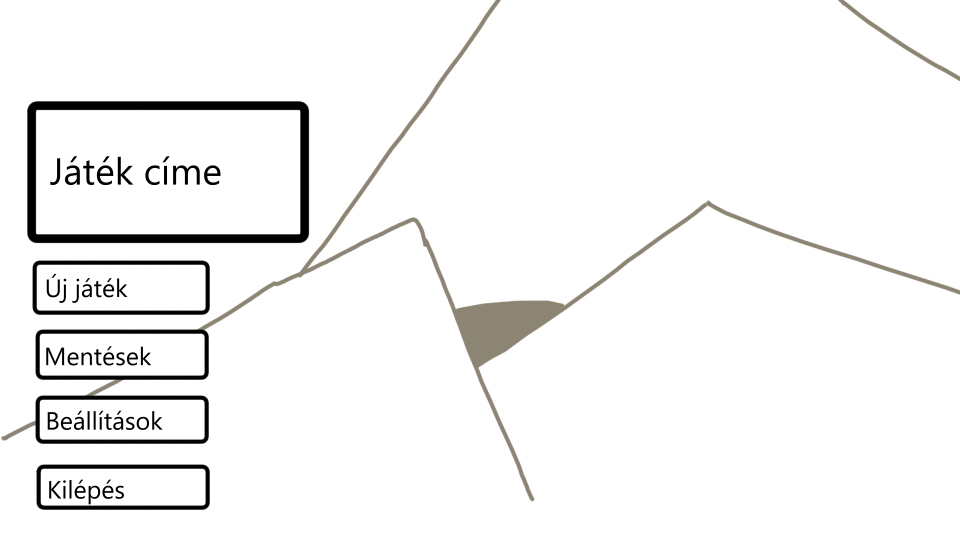
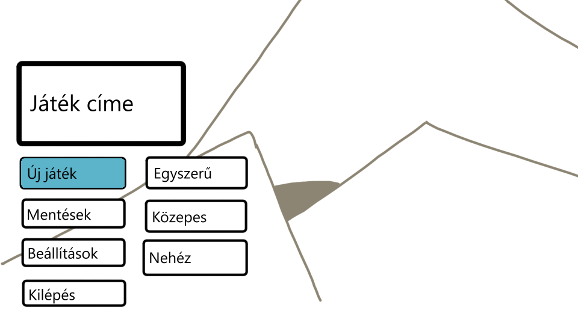
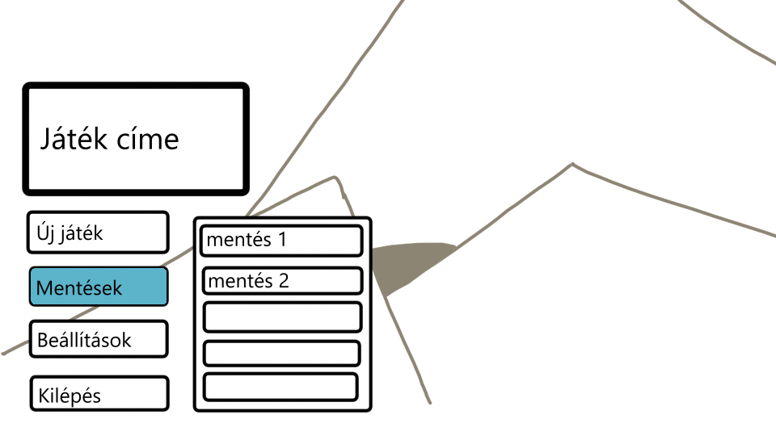
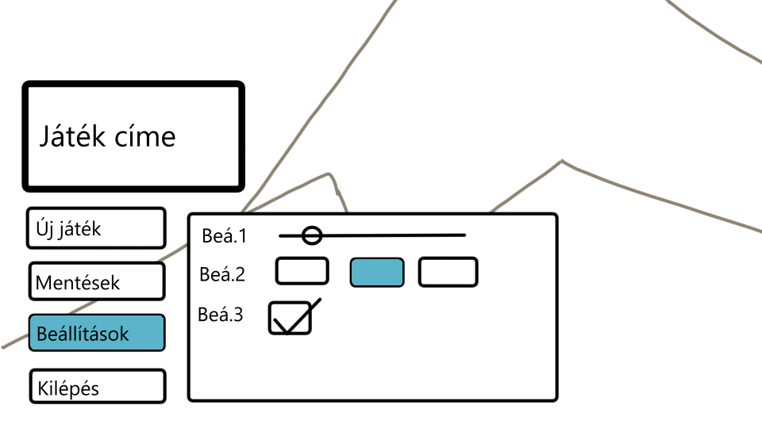
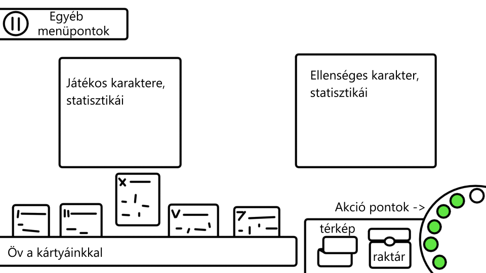
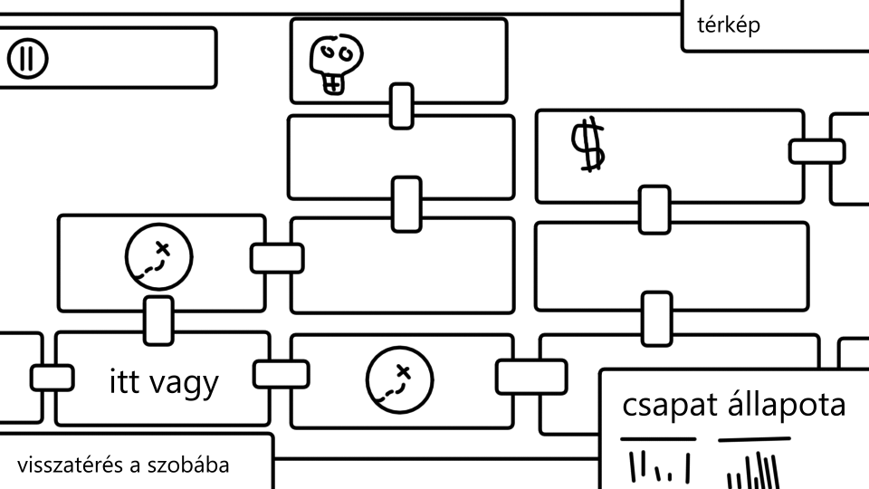
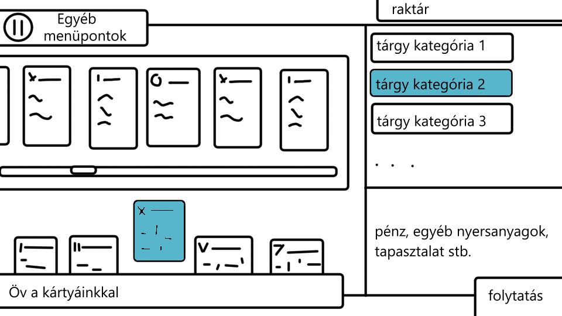
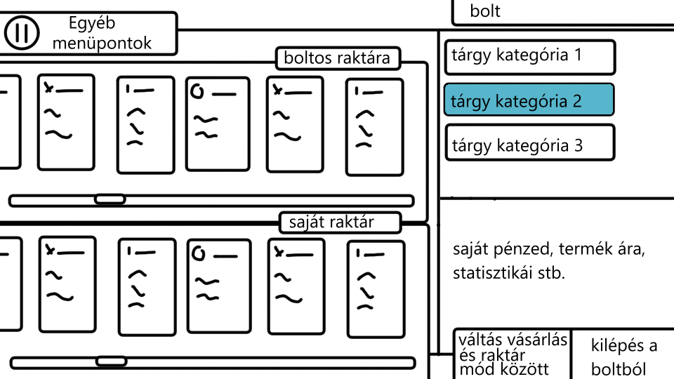
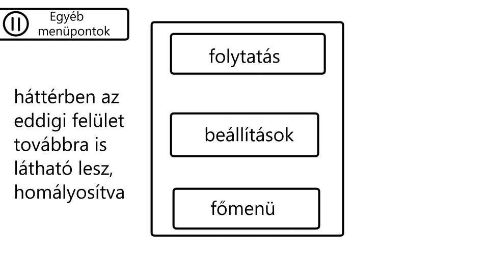

# Szoftverfejlesztési módszertanok nagy projekt funkcionális specifikáció
## CSK6
### Boross Károly, Boross Máté, Gergely Szabolcs Róbert

### Áttekintés
Egy olyan játékot fejlesztünk, melyben várbörtönöket szobáról szobára fedezhetünk fel, találhatunk titkos szobákat,
harcolhatunk sokféle ellenséggel, felszerelést szerezhetünk a hatékonyabb harcoláshoz, és még sok mást csinálhatunk.
A felszereléseink és ellenségeink közötti összefüggések kitapasztalásával felfedezhetőek lesznek gyengepontok, amelyek kihasználhatóak a jobb harcoláshoz.
Ez a játék számítógépen lesz elérhető, egyszerre több mentést támogatva, így több ember is játszhatja a játékot egyanazon az eszközön.

### Jelenlegi helyzet

A piacon kevés kör-alapú stratégiai felfedező játék van, ezért a mi játékunk ezt a formát használja alapjául.

### Követelménylista
|Modul|ID|Név|Verzió|Kifejtés|
|-----|--|---|------|--------|
|Felület|K1|Főmenü|1.0|A játék megnyitása után játék elkezdésére alkalmas felület jelenik meg.|
|Felület|K2|Mentés menü|1.0|A főmenüből elérhető egy menü a korábbi mentések folytatásához.|
|Felület|K3|Új játék|1.0|A játékosnak lehetősége van új játékot kezdeni a főmenüből.|
|Beállítások|K4|Nehézségi szint|1.0|A játék kezdetekor lehetőség van nehézségi szintek közül választani.|
|Játékmenet|K5|Felfedezés|1.0|A játék során szobák közötti mozgás lehetősége.|
|Játékmenet|K6|Fegyverek|1.0|A játék kezdetekor megszabott fegyverekhez való hozzáférés biztosítása, illetve a játék során újabb fegyverek megszerzésének lehetősége.|
|Játékmenet|K7|Felszerelés|1.0|Egyéb eszközök, például páncélok, pajzsok megszerzésének lehetősége.|
|Felület|K8|Raktár|1.0|Az eddig megszerzett tárgyaink elérésére és rendszerezésére biztosított felület.|
|Változtatás|K8|Felszereléscsere|1.0|Az eddig megszerzett felszerelések a raktárból való elővétele használható állapotba.|
|Játékmenet|K9|Ellenségek|1.0|Szobákban legyenek fellelhetőek ellenségek, amelyeket a játékos a megszerzett felszerelésével és varázslattal győzhet le.|
|Játékmenet|K10|Zsákmányolás|1.0|Egy szobában az összes ellenség legyőzése után kapjon a játékos zsákmányt.|
|Játékmenet|K11|Boltok|1.0|Egyes különleges szobákban a játékos tudja elkölteni az eddig megszerzett fizetőeszközeit újabb felszerelésre, illetve tudja beváltani az eddigi felszerelését fizetőeszkozre.|
|Játékmenet|K12|Csapattársak|1.0|Különleges helyszíneken csapattársak felbérlésének a lehetősége.|
|Játékmenet|K13|Pálya befejezés|1.0|Egy pályán lévő összes szoba sikeres teljesítése maradandó fejlesztések megszerzésére jogosítja fel a játékost.|
|Játékmenet|K14|Maradandó fejlesztések|1.0|A játékos a haladás megsegítése érdekében maradandó fejlesztésekhez kap hozzáférést.|
|Játékmenet|K15|Kör vége|1.0|Ha a játékos elveszíti a kört, akkor egy korábbi pontra állítódik vissza a haladás, egy megadott mennyiségű felszerelést kap, és választhat maradandó fejlesztéseket.|
|Rendszer|K16|Automatikus mentés|1.0|A kör elveszítése után a játék mentést készít, amely később betölthető.|
|Rendszer|K17|Játék félbehagyása|1.0|Korai kilépés a játékból játék végét eredményez, amely elindítja az automatikus mentést.|
|Felület|K18|Játék vége|1.0|Az összes pálya sikeres teljesítése után a játékos egy játék vége felületet kap, ahol az elért pontszámja megtekinthető.|
|Admin|K19|Alapvető admin felület|1.0|Debuggingra használható admin felület megvalósítása, melyben pályát lehet kihagyni, felszerelést beadni a karakternek, végtelen élet stb.
|Felépítés|K20|Véletlenszerű pályák|1.1|A pálya véletlenszerű generálása érdekesebb játékmenetértés több újrajátszhatóságért.|

### Jelenlegi üzleti folyamatok modellje
A mai piacon a játékok nagy része túl nagy hangsúlyt helyez a folyamatos játékra, a pontok folyamatos hajszolására, azért, hogy bármennyi
haladást is el tudjon érni a játékos, legyen is szó bármilyen típusú játékról. Ez a hangsúly a játékok élvezhetőségéből rengeteget elvesz,
mivel nem az igazi szórakozás és az alkalmi játék az előnyben részesített.

### Igényelt üzleti folyamatok modellje
A mi játékunknak egy bármikor felkapható, bármekkora időablak(ok)ban játszható és végigvihető kalandnak kell lennie, mely mindig felkelti a játékos
érdeklődését valami újjal. A monoton nersanyag vadászatot amelyet sok játékban látunk egy teljesen igazságos és kitapasztalható rendszer váltja le.

### Használati esetek
Játékos: a játék teljes egészéhez hozzáférést kap. A haladás szabályok szerint történik.
Admin: a teljes játékhoz hozzáfér, viszont csalásokkal megsezgheti a szabályokat, tesztelheti egyes nehezen hozzáférhető részeit a játéknak a sorban haladás nélkül.

### Képernyő tervek
A főmenü:

Új játék kezdése:

Régebbi mentések elérése:

Beállítások menü:

A játék alap kinézete:

Játék közben a térkép megnyitva:

Raktár:

Bolt:

Szünet menü:

### Forgatókönyv
Első játék kezdése: a játékos elindítja a játékot, betölt a főmenü. Az új játék gombra nyomva kiválaszthat egy nehézségi szintet, majd elkezdődik a játék. Felfedezi a pár első szobát, harcol ellelnségekkel,
de a játékismeret hiánya miatt hamar elbukik. A játék elmenti a haladását, ezt látja a játékos, ezért kikapcsolja a játékot.
Játék folytatása: később visszatérve a játékos szeretné folytatni a haladását. A főmenüben lévő mentések gombra kattintva eléri a korábbi mentéseit, és folytatja az előző játékot.

### Fogalomszótár