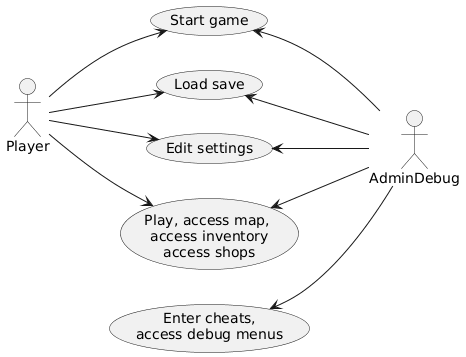

# Rendszerterv

1. A rendszer célja

Az alkalmazás célja egy szórakoztató, de kihívásokkal teli kaland nyújtása a felhasználó felé.
Az alkalmazás számítógépen érhető el, különálló programként.
A játék többféle pályán keresztül vesz részt, sokféle ellenséggel, eszközökkel, fegyverekkel.
A játékban való teljesítményért jobb felszerelést és karakterfejlesztéseket érhetünk el.

2. Projektterv

Projektfeladatok, felelősségek:

* Dizájnfelelős: Boross Károly

* Tesztfelelős: Boross Máté, Boross Károly

* Tervező: Gergely Szabolcs Róbert

* Frontend: Gergely Szabolcs Róbert

* Backend: Boross Máté

Ütemterv:
|Funkció/Story|Feladat/Task|Prioritás|Becslés|Aktuális becslés|Eltelt idő|Hátralévő idő|
|-------------|------------|---------|-------|----------------|----------|-------------|
|Követelmény specifikáció|||||||
|Funkcionális speicifikáció|||||||
|Rendszerterv|||||||
|Felület|Főmenü megtervezése||||||
||Fömenü implementálása||||||
||Egyéb menük megtervezése||||||
||Egyéb menük implementálása||||||
||HUD megtervezése||||||
||HUD implementálása||||||
|Játékelemek|Karakterek||||||
||Ellenségek||||||
||Fegyverek||||||
||Eszközök||||||
||Pályák tervezése||||||
||Pályák megvalósítása||||||
|Játékmenet|Harcrendszer||||||
||Boltok||||||
||Pálya felfedezése||||||
||Zsákmányolás||||||
||Felszerelések használata||||||
||Tapasztalat és szint rendszer||||||

3. Üzleti folyamatok modellje

4. Követelmények

